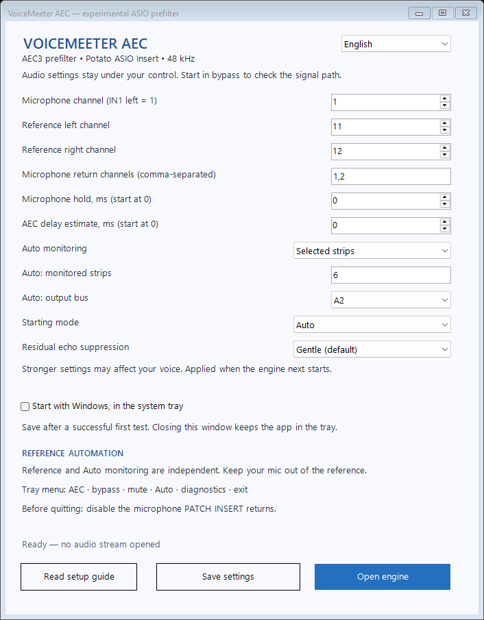

# VoiceMeeter AEC

Experimental Windows x64 acoustic echo cancellation prefilter for VoiceMeeter Potato.

**English / Français:** the launcher starts in English and has a language selector. Settings are saved locally. Setup guides are available in [English](GUIDE-EN.md) and [French](GUIDE-FR.md). Diagnostics use English in both modes for consistent issue reports.

VoiceMeeter AEC opens the installed **Voicemeeter Potato Insert Virtual ASIO** driver, feeds a selected stereo reference to the Sonora/WebRTC AEC3 engine, and returns only the selected microphone channels to the insert. It does not install drivers, change VoiceMeeter settings, capture through WASAPI, or send audio to speakers.

Version 0.1.3 supports **VoiceMeeter Potato only**. Gentle (the default) and Balanced pass all six synthetic AEC scenarios; Strong trades voice preservation for more aggressive suppression and fails some near-end criteria. Initial live use of 0.1.2 has been reported as working, including mute, with audible residual speaker sound. Controlled speech, acoustic, long-duration and latency measurements remain outstanding. Read the [validation results](VALIDATION-EN.md).

This release adds suppression choices, a tray menu, saved settings and optional Windows sign-in startup. Normal operation has no console window. See the [changelog](CHANGELOG.md) and the [documented Sonora patch](patches/README.md).

## Quick start

1. Extract the release ZIP to a permanent folder and run `Start.vbs` (CMD aliases remain available).
2. Configure your microphone and output devices in VoiceMeeter at 48 kHz.
3. Start in bypass with microphone input `1` and microphone returns `1,2`; verify the insert transport.
4. Select reference `11,12` when all playback is carried by VAIO, or use the matching channels of a dedicated reference input as explained in the guide.
5. Enable only the IN1 return in VoiceMeeter PATCH INSERT PRE-FX.
6. Test AEC, bypass, and mute. Disable PATCH INSERT before stopping the engine.

Auto is the default starting mode. It can watch selected strips (for example 6,7,8) or all playback routes to any hardware output bus A1–A5. It reads routing, mute, gain and solo, rather than instantaneous audio levels. The default watches VAIO strip 6 → A2; choose the output connected to your speakers. Reference channels and Auto monitoring are independent settings. Hover tips explain the controls in both languages.

After a successful test, choose your starting mode and suppression, enable **Start with Windows**, and **Save settings**. At sign-in the app waits for VoiceMeeter and starts the engine in the tray. VoiceMeeter must be configured separately to start and restore the tested insert routing. Disable PATCH INSERT before stopping the engine or updating the application. See the setup guide for startup, shutdown and removal details.

## Build

`Build.cmd` builds offline, remaps local paths out of the binary, and runs unit, DSP and launcher checks. Rust 1.91+, Visual C++/Windows SDK and Windows PowerShell 5.1 are required. `Compiler.cmd` is an alias for the same workflow. The ASIO headers use the GPLv3 option; see [third-party notices](THIRD-PARTY-EN.md).

For GitHub, extract the **Source** ZIP and commit its contents. The **Windows-x64** ZIP is the runnable release asset and also includes corresponding source and licenses. Build artifacts, local settings, shortcuts and personal diagnostic logs are excluded from the source archive. Both packages are experimental; see the validation limits before labeling a release stable.

## License

The project code is GPL-3.0-only. Sonora is BSD-3-Clause. The upstream Windows AEC Bridge that inspired the architecture is MIT. See [LICENSE](LICENSE) and [third-party notices](THIRD-PARTY-EN.md).
