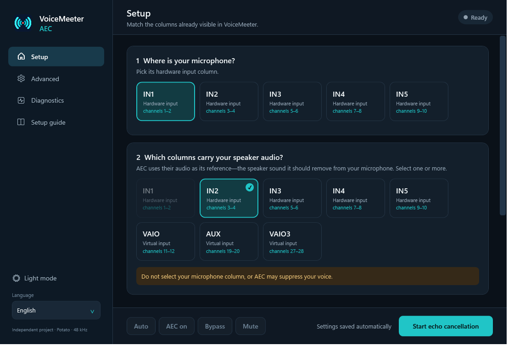
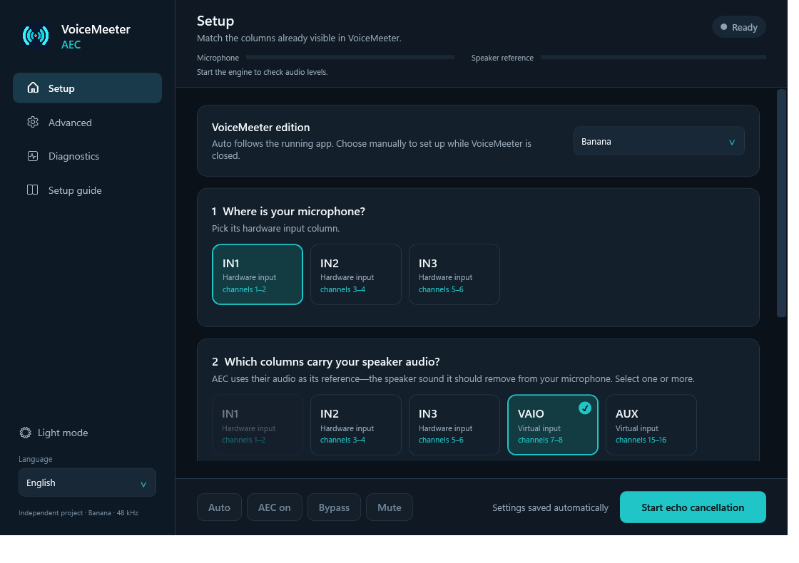
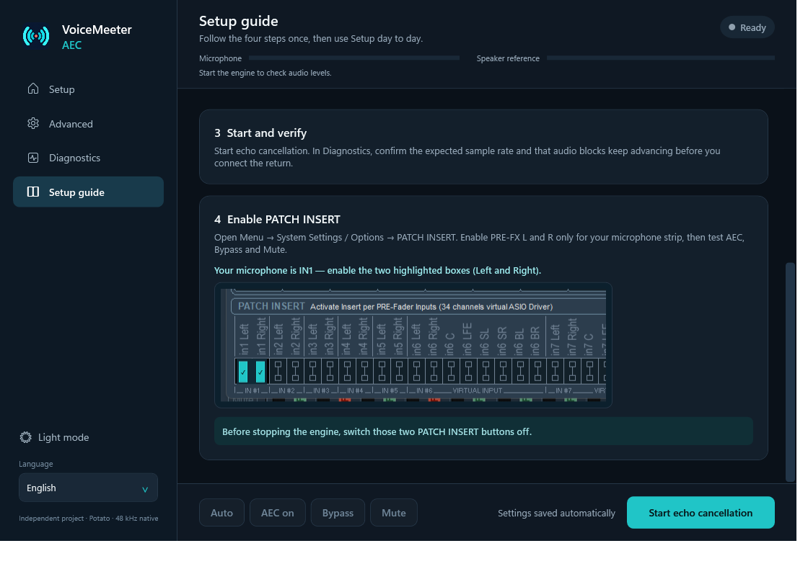
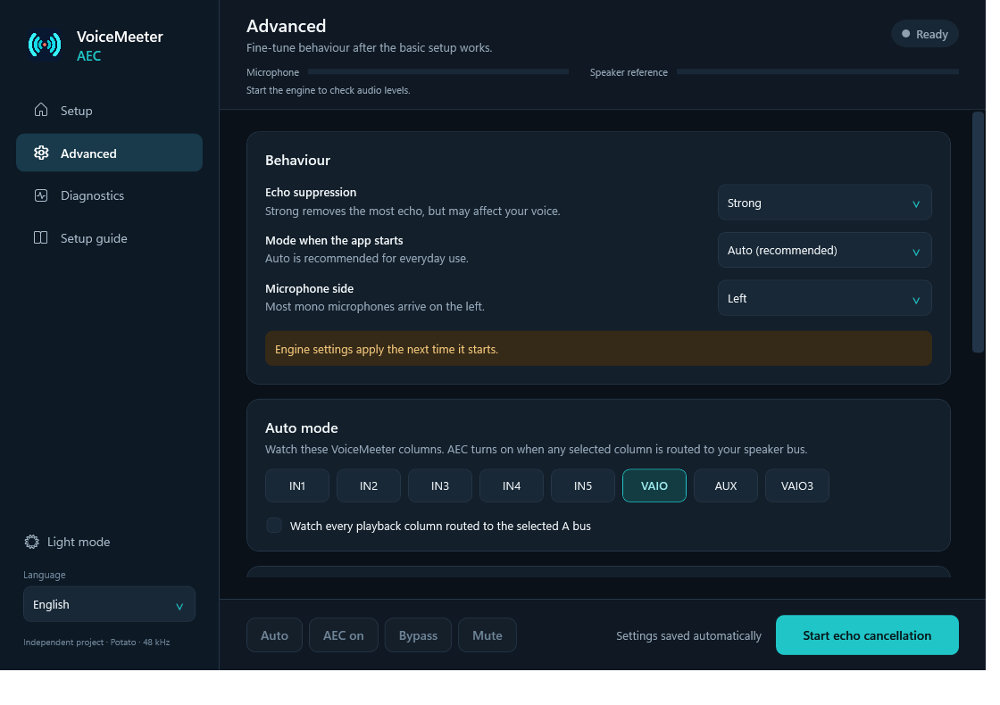

<p align="center">
  
</p>

<p align="center">
  <a href="https://github.com/BeeeFX/VoiceMeeter-AEC/releases/latest"></a>
  <a href="https://github.com/BeeeFX/VoiceMeeter-AEC/releases"></a>
  
  
  
</p>

<p align="center">
  <a href="https://github.com/BeeeFX/VoiceMeeter-AEC/releases/latest/download/VoiceMeeter-AEC-Setup.exe"></a>
</p>

<p align="center">
  <sub>Windows 10/11 x64 · One installer · No admin rights or separate .NET install</sub><br>
  <a href="https://github.com/BeeeFX/VoiceMeeter-AEC/releases/latest">Portable ZIP</a> · <a href="GUIDE-EN.md">Detailed setup</a> · <a href="GUIDE-FR.md">Guide français</a> · <a href="https://github.com/BeeeFX/VoiceMeeter-AEC/releases/latest">Release notes</a>
</p>

VoiceMeeter AEC lets you use speakers without sending the room echo back into calls, streams, or recordings. Pick the same columns you already see in VoiceMeeter, follow the built-in guide once, and let Auto mode handle normal use.



<p align="center"><sub>Potato shown above. Banana is detected automatically and uses its smaller mixer layout.</sub></p>

Under the hood, the app connects to the matching **VoiceMeeter Banana or Potato Insert Virtual ASIO** driver, processes the microphone with Sonora/WebRTC AEC3, and returns the cleaned signal to the same VoiceMeeter strip.

The app detects the running VoiceMeeter edition and shows only its real mixer layout. Banana users see **IN1–IN3, VAIO, AUX and A1–A3**; Potato users see **IN1–IN5, VAIO, AUX, VAIO3 and A1–A5**. You can override detection before starting the engine. When VoiceMeeter is open, your own strip labels appear on the cards as well.

## Get started

1. Download and run **VoiceMeeter-AEC-Setup.exe**. It installs for your Windows account, adds VoiceMeeter AEC to the Start menu, and includes the .NET runtime. No administrator rights are needed. A portable ZIP remains available on the [release page](https://github.com/BeeeFX/VoiceMeeter-AEC/releases/latest).
2. In the app, choose the microphone column, one or more playback columns whose audio becomes the echo reference, and the speaker A bus that Auto mode should watch.
3. Open **Setup guide** inside the app, then follow its PATCH INSERT and verification steps.
4. Select **Start echo cancellation**. Auto mode enables AEC when the chosen playback route is active and bypasses it when that route is inactive.

Your normal controls remain available from the window and the system tray: **Auto, AEC on, Bypass, and Mute**. Settings save automatically. Under **Advanced**, Windows startup and automatic engine startup are separate options. The app can also check the latest stable GitHub release at most once a day and asks before installing anything.

| Banana layout | Integrated setup guide |
|:---:|:---:|
|  |  |



> Before stopping the audio engine or removing the app, disable the microphone’s PATCH INSERT returns. If setup ever leaves the microphone silent, disabling those two returns immediately restores VoiceMeeter’s direct signal path.

## Why PATCH INSERT still needs one manual step

Patch Insert is the audio connection the app uses; it does not determine the app’s appearance or require users to work with raw channel numbers. VoiceMeeter AEC translates its interface into named mixer columns internally.

The app intentionally reads VoiceMeeter routing without changing it. This protects existing mixer setups, but it means the two microphone return switches still have to be enabled in VoiceMeeter itself. The integrated guide covers the normal setup; the detailed [English](GUIDE-EN.md) and [French](GUIDE-FR.md) guides cover less common reference and routing cases.

## What it supports

| | Support |
|---|---|
| VoiceMeeter | Banana and Potato; detected automatically with a manual override |
| Platform | Windows x64 |
| Sample rate | 48 kHz |
| Microphone source | Banana IN1–IN3 or Potato IN1–IN5, left or right |
| Playback reference | One or more strips; VAIO and AUX are common choices, plus VAIO3 on Potato |
| AEC modes | Auto, always on, bypass, mute |
| Suppression | Strong by default for new setups; Gentle and Balanced remain available |
| Startup | Optional Windows sign-in launch, with a separate automatic engine-start toggle |

The reference must contain all audio played by your speakers and exclude the microphone. Select every relevant playback column; the engine combines their stereo pairs before AEC processing. See [Reference setup](GUIDE-EN.md#reference-the-sound-to-cancel) for details.

The reference mix follows the selected speaker bus's routing, mutes and levels, with headroom to avoid clipping multiple sources. Live meters and status messages show whether audio is flowing, Auto is cancelling or bypassing, or routing/reference information is unavailable. Audio settings stay locked while the engine runs so the setup guide matches the active connection.

## Validation status

Gentle and Balanced pass all six synthetic AEC scenarios. Strong offers more aggressive suppression but can affect near-end voice quality. Live use has confirmed the Insert transport, controls, and mute path; controlled room, speech, long-duration, and hardware latency measurements remain in progress. See the detailed [validation results](VALIDATION-EN.md).

## Build from source

Requirements: Windows x64, Rust 1.91 or newer, Visual C++ with the Windows SDK, the .NET 8 SDK or newer, and Inno Setup 7 for the installer.

```powershell
.\Build.cmd
powershell.exe -NoProfile -ExecutionPolicy Bypass -File .\Package.ps1
```

The build runs offline Rust tests, synthetic DSP checks, desktop UI checks, and creates a self-contained Windows app. Packaging produces the single-file installer, a minimal portable/update ZIP, and a separate source ZIP, each with a SHA-256 file. More detail is in [PUBLISHING.md](PUBLISHING.md).

## License

Project code is [GPL-3.0-only](LICENSE). Sonora is BSD-3-Clause. The upstream Windows AEC Bridge that inspired the architecture is MIT. See [third-party notices](THIRD-PARTY-EN.md).

VoiceMeeter AEC is an independent project and is not affiliated with VB-Audio or Steinberg.
